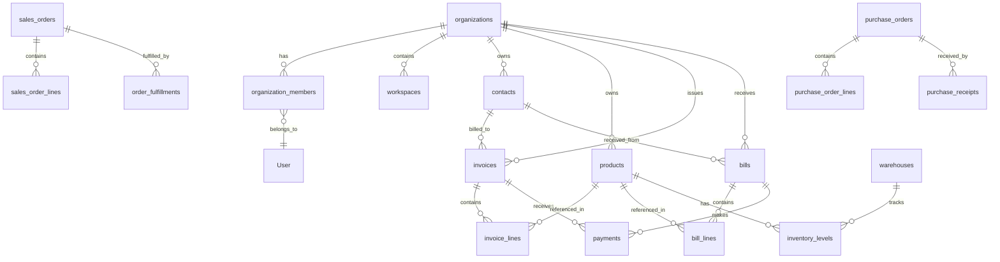

# Database Schema Documentation

## Overview

The OmniZen database is designed as a multi-tenant ERP system with comprehensive financial, inventory, and AI capabilities. The database uses PostgreSQL with Row Level Security (RLS) to ensure complete data isolation between organizations.

## Schema Architecture

### Physical Schemas

1. **`public`** - Main application schema containing all tables
2. **`semantic`** - Read-only views optimized for AI agent queries
3. **`drizzle`** - Migration tracking (system managed)
4. **`auth`** - Supabase authentication (system managed)

### Logical Groupings

While all tables exist in the `public` schema, they are logically organized into modules:

- **Core**: Organization and user management
- **Finance**: Accounting and financial transactions
- **ERP**: Warehouse, orders, and banking
- **AI**: Agent automation and intelligence

## Table Relationships

## Core Tables

### organizations
Primary tenant table for multi-tenancy.

| Column | Type | Description |
|--------|------|-------------|
| id | uuid | Primary key |
| name | varchar(255) | Organization name |
| industry | varchar(100) | Industry type |
| size | varchar(50) | Company size |
| country | varchar(2) | ISO country code |
| timezone | varchar(50) | Timezone |
| fiscal_year_end | integer | Month number (1-12) |
| base_currency | varchar(3) | Default currency |
| created_at | timestamp | Creation timestamp |
| updated_at | timestamp | Last update |

### organization_members
Links users to organizations with roles and permissions.

| Column | Type | Description |
|--------|------|-------------|
| id | uuid | Primary key |
| organization_id | uuid | FK to organizations |
| user_id | uuid | FK to User |
| role | enum | User role (owner, admin, manager, accountant, employee, viewer) |
| permissions | jsonb | Granular permissions |
| allowed_workspaces | jsonb | Workspace access list |
| joined_at | timestamp | Join date |
| invited_by | uuid | FK to User who invited |
| is_active | boolean | Active status |

### workspaces
Sub-divisions within organizations for further data isolation.

| Column | Type | Description |
|--------|------|-------------|
| id | uuid | Primary key |
| organization_id | uuid | FK to organizations |
| name | varchar(255) | Workspace name |
| description | text | Description |
| type | varchar(50) | Workspace type |
| settings | jsonb | Workspace settings |
| is_active | boolean | Active status |
| created_at | timestamp | Creation timestamp |

### User
User accounts (NextAuth compatible).

| Column | Type | Description |
|--------|------|-------------|
| id | uuid | Primary key |
| email | varchar(255) | Email address |
| name | varchar(255) | Display name |
| password | varchar(255) | Hashed password |
| image | text | Profile image URL |
| created_at | timestamp | Registration date |
| last_active_at | timestamp | Last activity |

## Financial Tables

### contacts
Customers and vendors for the organization.

| Column | Type | Description |
|--------|------|-------------|
| id | uuid | Primary key |
| organization_id | uuid | FK to organizations |
| type | enum | Contact type (customer, vendor, both) |
| name | varchar(255) | Legal name |
| display_name | varchar(255) | Display name |
| email | varchar(255) | Primary email |
| phone | varchar(50) | Phone number |
| tax_number | varchar(50) | Tax ID |
| billing_address | jsonb | Billing address |
| shipping_address | jsonb | Shipping address |
| payment_terms | integer | Payment terms in days |
| credit_limit | decimal(15,2) | Credit limit |
| currency_code | varchar(3) | Preferred currency |
| is_active | boolean | Active status |

### products
Products and services catalog.

| Column | Type | Description |
|--------|------|-------------|
| id | uuid | Primary key |
| organization_id | uuid | FK to organizations |
| sku | varchar(100) | Stock keeping unit |
| name | varchar(255) | Product name |
| description | text | Description |
| type | enum | Type (product, service) |
| category | varchar(100) | Category |
| unit_of_measure | varchar(50) | UOM |
| sale_price | decimal(15,2) | Default sale price |
| purchase_price | decimal(15,2) | Default purchase price |
| tax_code_id | uuid | FK to tax_codes |
| is_inventoried | boolean | Track inventory |
| reorder_point | decimal(15,3) | Reorder level |
| reorder_quantity | decimal(15,3) | Reorder qty |

### invoices
Sales invoices issued to customers.

| Column | Type | Description |
|--------|------|-------------|
| id | uuid | Primary key |
| organization_id | uuid | FK to organizations |
| invoice_number | varchar(50) | Invoice number |
| contact_id | uuid | FK to contacts |
| invoice_date | date | Invoice date |
| due_date | date | Due date |
| status | enum | Status (draft, sent, paid, overdue, cancelled) |
| currency_code | varchar(3) | Currency |
| exchange_rate | decimal(10,6) | Exchange rate |
| subtotal | decimal(15,2) | Subtotal |
| tax_amount | decimal(15,2) | Tax total |
| total_amount | decimal(15,2) | Total amount |
| amount_paid | decimal(15,2) | Amount paid |
| notes | text | Invoice notes |

### bills
Purchase bills from vendors.

| Column | Type | Description |
|--------|------|-------------|
| id | uuid | Primary key |
| organization_id | uuid | FK to organizations |
| bill_number | varchar(50) | Bill number |
| vendor_id | uuid | FK to contacts |
| bill_date | date | Bill date |
| due_date | date | Due date |
| status | enum | Status (draft, approved, paid, overdue, cancelled) |
| currency_code | varchar(3) | Currency |
| subtotal | decimal(15,2) | Subtotal |
| tax_amount | decimal(15,2) | Tax total |
| total_amount | decimal(15,2) | Total amount |
| amount_paid | decimal(15,2) | Amount paid |

### chart_accounts
Chart of accounts for double-entry bookkeeping.

| Column | Type | Description |
|--------|------|-------------|
| id | uuid | Primary key |
| organization_id | uuid | FK to organizations |
| code | varchar(20) | Account code |
| name | varchar(255) | Account name |
| type | enum | Type (asset, liability, equity, revenue, expense) |
| subtype | varchar(50) | Subtype |
| parent_id | uuid | Parent account |
| is_active | boolean | Active status |
| balance | decimal(15,2) | Current balance |

## Warehouse & Inventory Tables

### warehouses
Physical or virtual warehouse locations.

| Column | Type | Description |
|--------|------|-------------|
| id | uuid | Primary key |
| organization_id | uuid | FK to organizations |
| workspace_id | uuid | FK to workspaces |
| code | varchar(20) | Warehouse code |
| name | varchar(255) | Warehouse name |
| type | enum | Type (main, branch, retail, distribution, virtual) |
| address | jsonb | Physical address |
| manager_id | uuid | FK to User |
| is_active | boolean | Active status |

### inventory_levels
Current inventory levels by product and warehouse.

| Column | Type | Description |
|--------|------|-------------|
| id | uuid | Primary key |
| organization_id | uuid | FK to organizations |
| warehouse_id | uuid | FK to warehouses |
| product_id | uuid | FK to products |
| quantity_on_hand | decimal(15,3) | Physical quantity |
| quantity_reserved | decimal(15,3) | Reserved quantity |
| quantity_available | decimal(15,3) | Available quantity |
| average_cost | decimal(15,4) | Average unit cost |
| last_counted_at | timestamp | Last physical count |

### stock_moves
Track all inventory movements.

| Column | Type | Description |
|--------|------|-------------|
| id | uuid | Primary key |
| organization_id | uuid | FK to organizations |
| type | enum | Movement type (receipt, issue, transfer, adjustment) |
| from_warehouse_id | uuid | Source warehouse |
| to_warehouse_id | uuid | Destination warehouse |
| product_id | uuid | FK to products |
| quantity | decimal(15,3) | Quantity moved |
| unit_cost | decimal(15,4) | Unit cost |
| reference_type | varchar(50) | Reference document type |
| reference_id | uuid | Reference document ID |
| moved_at | timestamp | Movement timestamp |

## Order Management Tables

### sales_orders
Customer sales orders.

| Column | Type | Description |
|--------|------|-------------|
| id | uuid | Primary key |
| organization_id | uuid | FK to organizations |
| workspace_id | uuid | FK to workspaces |
| order_number | varchar(50) | Order number |
| customer_id | uuid | FK to contacts |
| order_date | date | Order date |
| expected_delivery_date | date | Expected delivery |
| status | enum | Status (draft, confirmed, in_fulfillment, fulfilled, cancelled) |
| currency_code | varchar(3) | Currency |
| total_amount | decimal(15,2) | Total amount |
| total_quantity_ordered | decimal(15,3) | Total quantity |
| total_quantity_fulfilled | decimal(15,3) | Fulfilled quantity |

### purchase_orders
Vendor purchase orders.

| Column | Type | Description |
|--------|------|-------------|
| id | uuid | Primary key |
| organization_id | uuid | FK to organizations |
| workspace_id | uuid | FK to workspaces |
| order_number | varchar(50) | PO number |
| vendor_id | uuid | FK to contacts |
| order_date | date | Order date |
| expected_receipt_date | date | Expected receipt |
| status | enum | Status (draft, sent, confirmed, receiving, received, cancelled) |
| currency_code | varchar(3) | Currency |
| total_amount | decimal(15,2) | Total amount |
| total_quantity_ordered | decimal(15,3) | Ordered quantity |
| total_quantity_received | decimal(15,3) | Received quantity |

## AI & Automation Tables

### ai_agents
Configured AI agents for automation.

| Column | Type | Description |
|--------|------|-------------|
| id | uuid | Primary key |
| organization_id | uuid | FK to organizations |
| name | varchar(255) | Agent name |
| type | varchar(50) | Agent type |
| model | varchar(100) | AI model |
| system_prompt | text | System instructions |
| capabilities | jsonb | Enabled capabilities |
| max_tokens | integer | Token limit |
| temperature | decimal(2,1) | Temperature setting |
| is_active | boolean | Active status |

### agent_erp_permissions
Granular ERP permissions for AI agents.

| Column | Type | Description |
|--------|------|-------------|
| id | uuid | Primary key |
| organization_id | uuid | FK to organizations |
| agent_id | uuid | FK to ai_agents |
| resource_type | varchar(50) | Resource type |
| allowed_actions | jsonb | Allowed actions |
| field_restrictions | jsonb | Field-level restrictions |
| value_constraints | jsonb | Value constraints |
| workspace_restrictions | uuid[] | Allowed workspaces |

### semantic_catalog
Metadata for semantic layer.

| Column | Type | Description |
|--------|------|-------------|
| id | uuid | Primary key |
| organization_id | uuid | FK to organizations (nullable for global) |
| entity_type | varchar(50) | Entity type |
| entity_name | varchar(100) | Entity name |
| display_name | varchar(255) | Display name |
| description | text | Description |
| semantic_type | varchar(50) | Semantic classification |
| relationships | jsonb | Related entities |
| sample_queries | jsonb | Example queries |
| is_active | boolean | Active status |

## Semantic Views

The `semantic` schema contains AI-optimized views that aggregate data for intelligent querying:

### v_balance_sheet
Real-time balance sheet with assets, liabilities, and equity.

### v_profit_loss_statement
Income statement with revenues, expenses, and profitability metrics.

### v_cash_flow_statement
Cash flow from operations, investing, and financing activities.

### v_ar_aging_report
Accounts receivable aging buckets (current, 30, 60, 90+ days).

### v_ap_aging_report
Accounts payable aging buckets.

### v_customer_revenue
Customer revenue analysis with totals and trends.

### v_inventory_status
Current inventory status across all warehouses.

### v_order_pipeline
Sales and purchase order pipeline status.

### v_financial_ratios
Key financial ratios (liquidity, profitability, efficiency).

### v_kpi_dashboard
Business KPIs including revenue, margins, and operational metrics.

## Row Level Security (RLS)

All tables implement RLS policies using these helper functions:

- `auth_org_id()` - Returns current user's organization ID
- `auth_user_id()` - Returns current user ID
- `auth_workspace_id()` - Returns current workspace ID
- `auth_role()` - Returns user's role

### Policy Patterns

1. **Organization Isolation**: Most tables filter by `organization_id = auth_org_id()`
2. **Workspace Isolation**: Some tables add `workspace_id = auth_workspace_id()`
3. **Role-based Access**: Sensitive operations check `auth_role() IN ('admin', 'owner')`
4. **Parent-Child**: Line items check parent table permissions via EXISTS

## Indexes

Key indexes for performance:

- All foreign keys are indexed
- Composite indexes on (organization_id, status) for filtered queries
- Unique indexes on (organization_id, invoice_number) for business keys
- Full-text search indexes on name and description fields
- Timestamp indexes for time-series queries

## Data Types

### Monetary Values
All monetary fields use `DECIMAL(15,2)` for precision:
- Supports values up to 999,999,999,999.99
- Maintains 2 decimal places for currency
- No floating-point rounding errors

### Quantities
Inventory quantities use `DECIMAL(15,3)`:
- Supports fractional quantities
- 3 decimal places for precision

### Enums
PostgreSQL enums for type safety:
- `user_role`: owner, admin, manager, accountant, employee, viewer
- `contact_type`: customer, vendor, both
- `invoice_status`: draft, sent, paid, overdue, cancelled
- `product_type`: product, service

### JSONB Fields
Used for flexible, schema-less data:
- Addresses (billing, shipping)
- Permissions and settings
- Metadata and custom fields
- API responses and logs

## Migration Strategy

### Table Migrations (Drizzle)
1. Define schema in TypeScript (`/lib/db/schema/`)
2. Generate SQL migration: `pnpm db:generate`
3. Apply migration: `pnpm db:migrate`

### RLS/View Migrations (Supabase)
1. Create SQL file in `/supabase/migrations/`
2. Write RLS policies or views
3. Apply: `pnpm supabase:migrate:local`

### Best Practices
- Never mix table creation and RLS in same system
- Always test migrations with `pnpm db:reset:local`
- Use transactions for complex migrations
- Maintain backward compatibility
- Document breaking changes

## Performance Considerations

1. **Partition large tables**: Consider partitioning by organization_id for tables > 1M rows
2. **Archive old data**: Move historical data to archive tables
3. **Optimize queries**: Use EXPLAIN ANALYZE for slow queries
4. **Connection pooling**: Use Supabase pooler for high concurrency
5. **Caching**: Implement Redis caching for frequently accessed data

## Security

1. **RLS enforcement**: All tables have RLS enabled and enforced
2. **Service role bypass**: Only service role can bypass RLS
3. **Audit logging**: All modifications logged to audit tables
4. **Encryption**: Sensitive data encrypted at rest
5. **Secrets management**: Use environment variables, never commit secrets